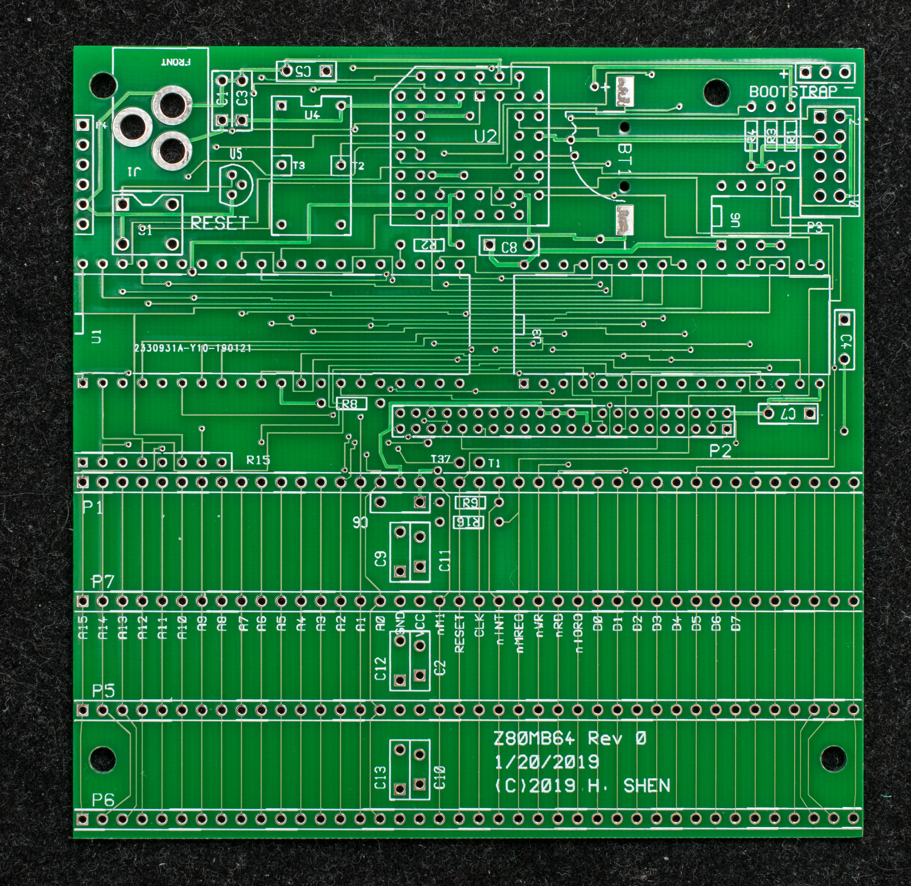
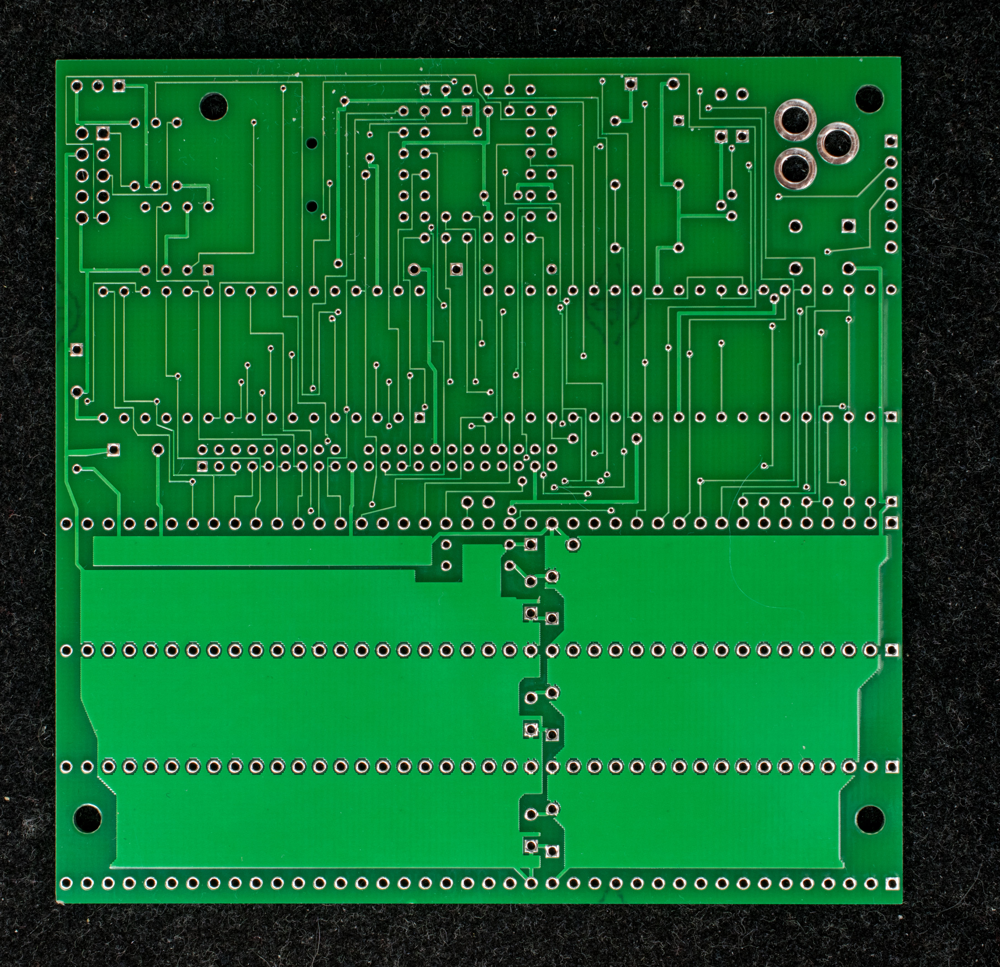
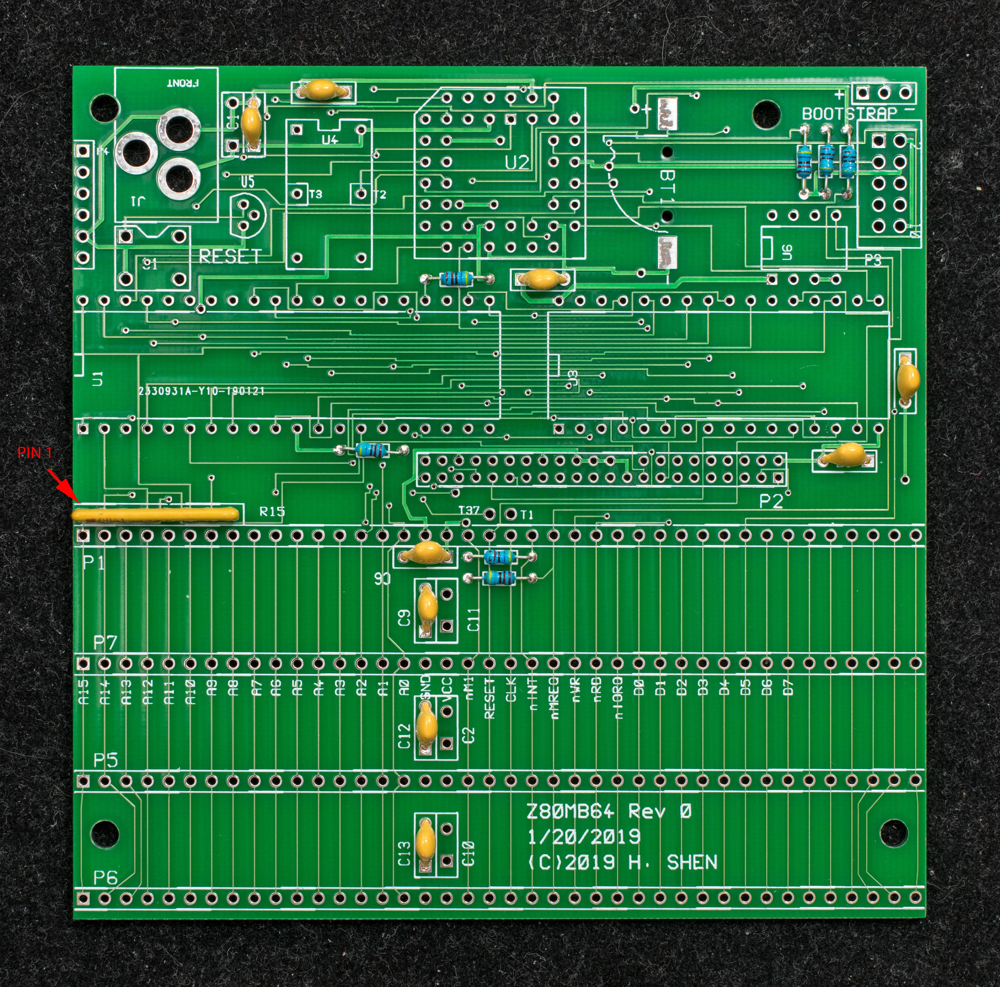
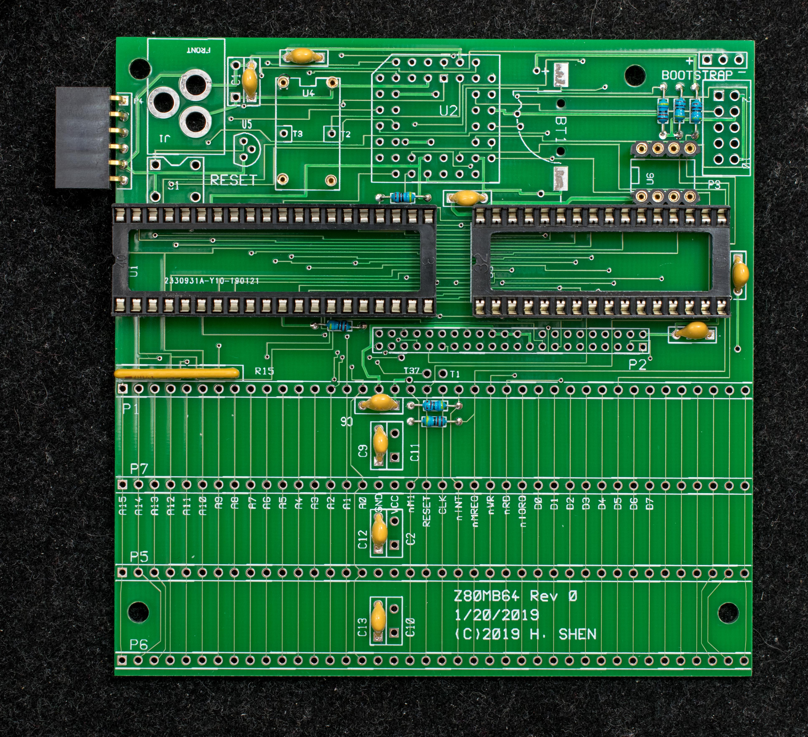
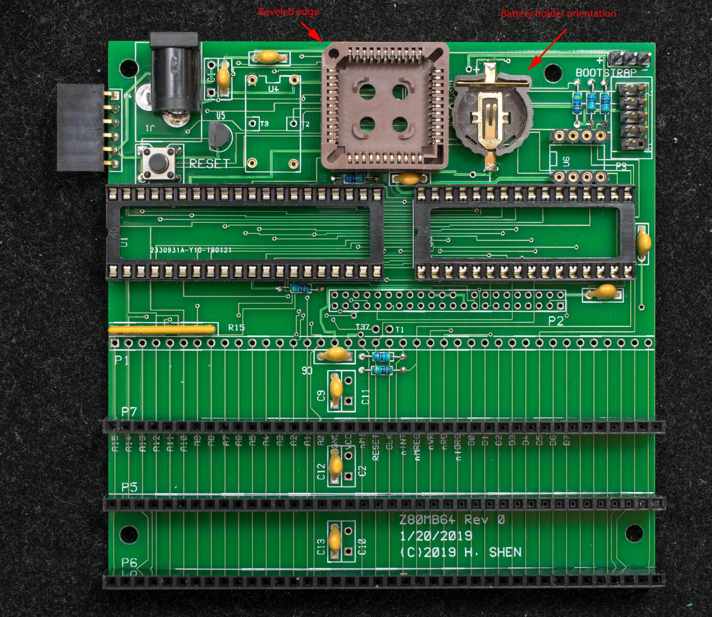
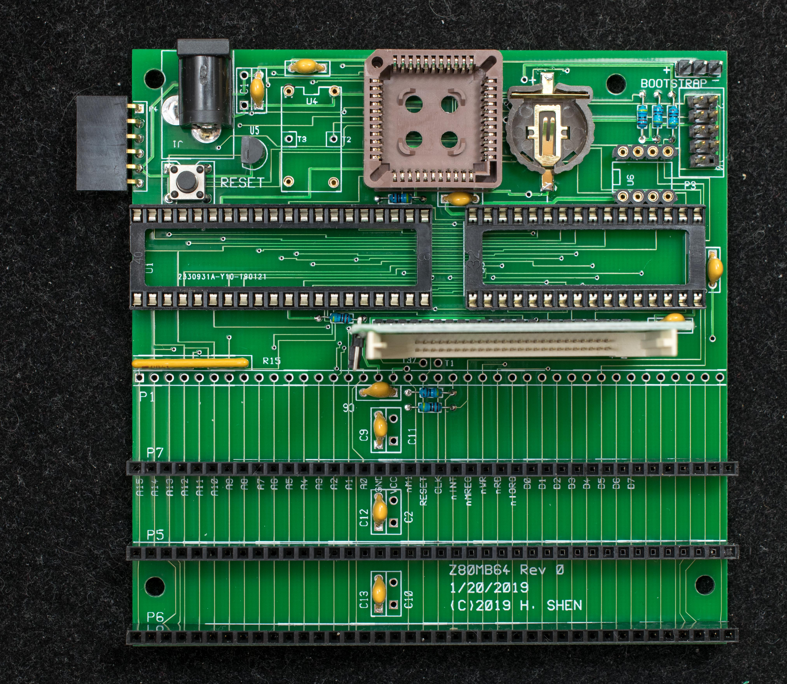
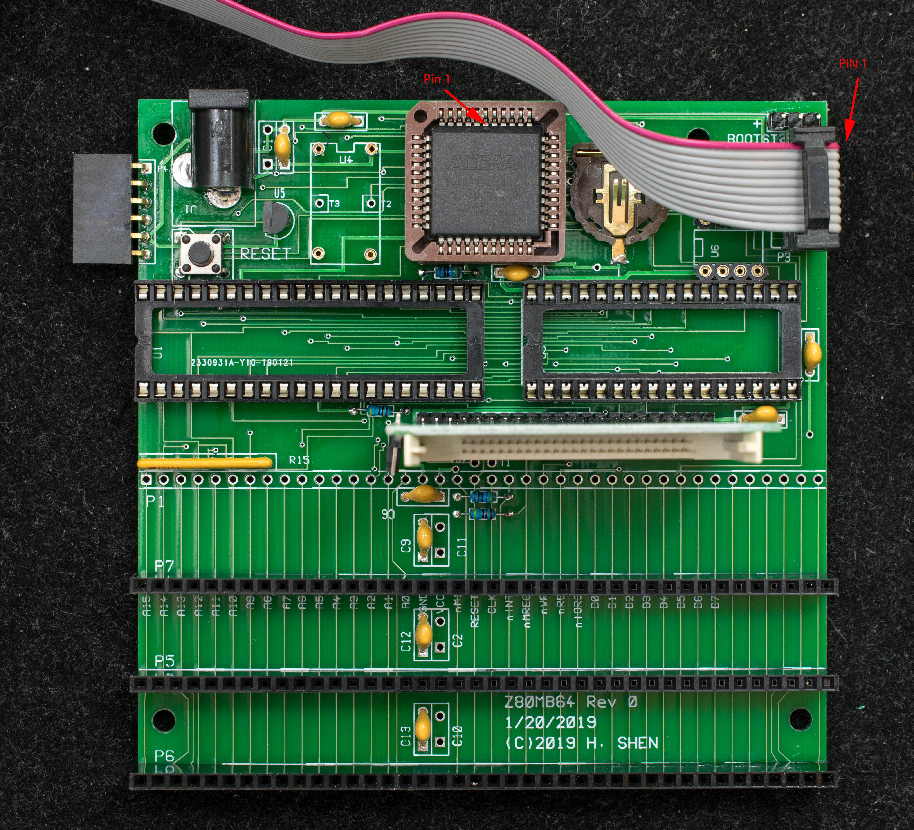

# Pictorial Assembly Guide of Z80MB64
The order of assembly is based on the height of the components, the lowest components are soldered down first and the tallest last.

Bare PC board, component side

Bare PC board, solder side

1. Solder down all resistors (4.7K), bypass capacitor (0.1uF), and SIP resistor (4.7K BUS). The orientation of SIP resistor is important, pin 1 is marked with a black bar on the SIP package and should be positioned where the red arrow is pointed.

2. Install the IC sockets as well as the 1×6 serial port header.

3. Install the PLCC socket. The orientation of the socket is important, the beveled corner should be placed where the red arrow is pointed. Also install 1×3 jumper block (T34), 2×5 programming header (P3), push button (S1), 2.1mm x 5.5mm power jack (J1), and CR1220 battery holder are also installed. Observe the orientation of the battery holder as indicated on the picture below.

4. Install the CF adapter. The connector is keyed so it can only be installed in one orientation. Solder one pin, make sure the adapter is perpendicular to the mother board before soldering the rest.

5. Populate just the CPLD and power up the board to program it. Observe the orientation of the CPLD and programming cable as indicated on the picture below.

6. Populate all components

