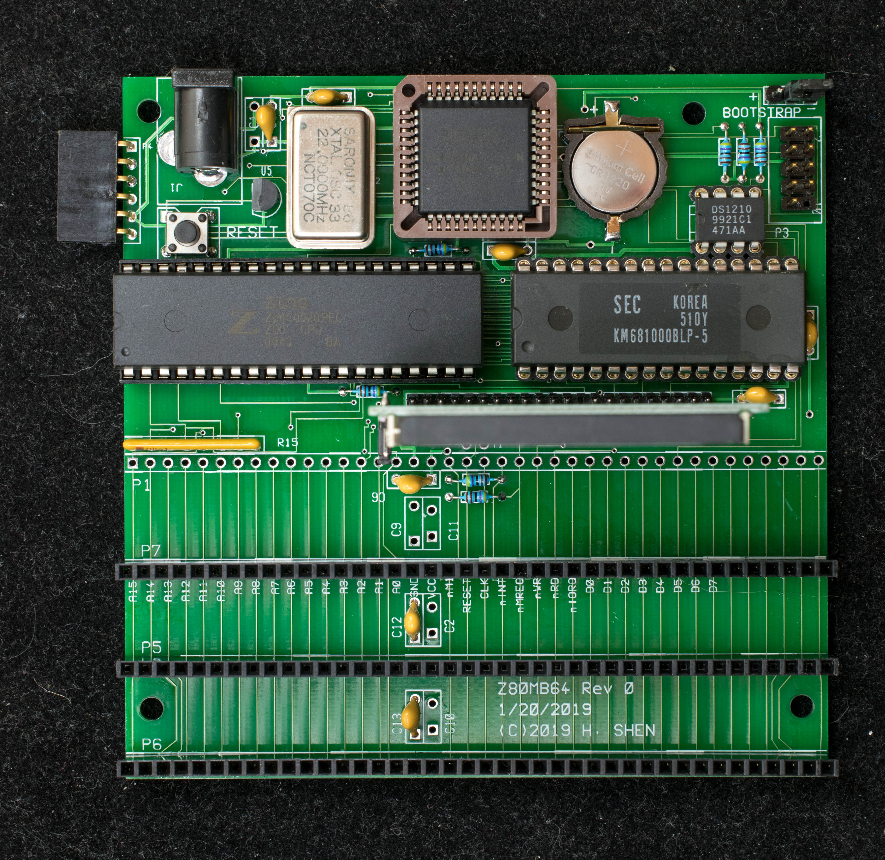
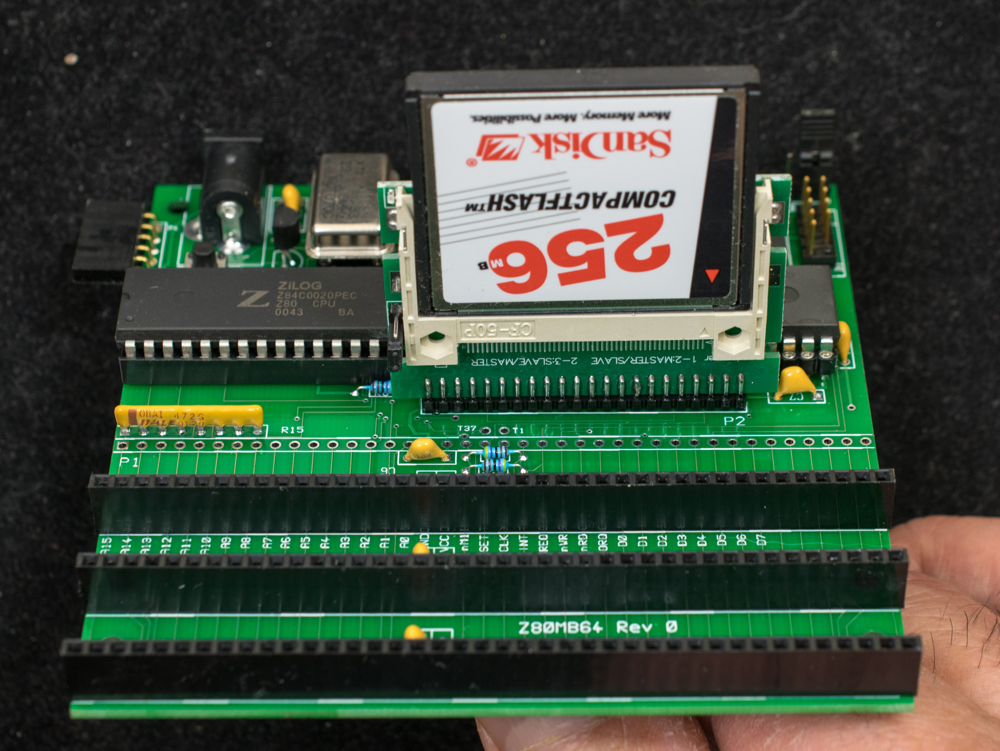
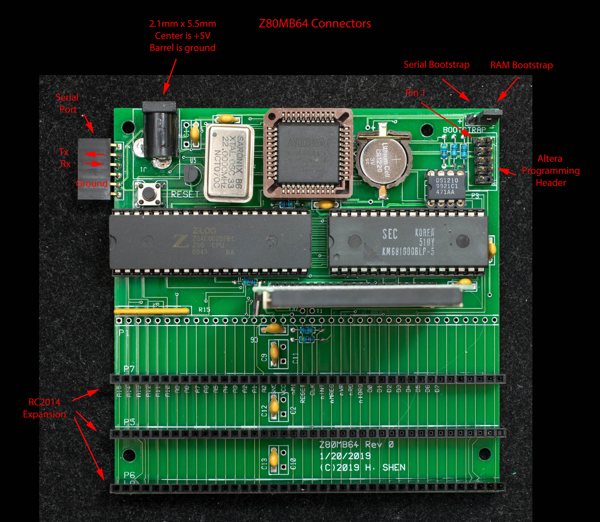

# Z80MB64, A Z80-based, Hobbyist-friendly, RC2014-compatible Motherboard
### Introduction
Z80MB64 is based on Z80SBC64 with 3 RC2014 expansion connectors. All the software that runs on Z80SBC64 will also run on Z80MB64.

### Features
- Z80 running at 22MHz
- Battery-backed 128K RAM in four 32-K banks.
- No boot ROM, use serial port to load bootstrap software initially
- Serial port operates at 115200-N-8-1
- Compact flash interface
- CP/M 2.2 ready
- Three RC2014 expansion connectors
- 102mm x 102mm pc board

### Functions
The heart of Z80MB64 is a 5V CPLD, Altera EPM7064S, that implements the serial port receive function, generates baud clock, interfaces to compact flash, and divides memory into 4 banks of 32KB. The design has no ROM. The traditional ROM software are stored in battery-backed RAM. The serial bootstrap function loads the ROM-equivalent software into RAM when the board is powered up the first time; the system boots off the software in RAM for subsequent power cycles or resets. The ROM-equivalent software are protected by switching to banks inaccessible to normal software.

Instead of the EPM7128S, a smaller EPM7064S is used because it is available in PLCC44 package that can be socketed in a 44-pin PLCC through-hole socket. This is the design compromise to enable a hobbyist-friendly board with through-hole components and an easy-to-solder surface mount connector. Because of the limited resources on EPM7064S, the memory supported is 128KB with 4 banks of 32KB. Furthermore, the serial port transmit function is emulate in software (bit banging).

### Design information
- [Schematic](z80mb64_rev0_scm.pdf) of Z80MB64
- [Gerber photoplots](z80mb64_r0_gerber.zip). The pc board was manufactured by JLCPCB
- [Altera EPM7064SLC44 design file](z80sbc64_r0_CPLD_epm7064.zip). The design are created as schematic in Quartus 8.1. This is a PDF file of the schematic
- [Memory and I/O map](https://github.com/Plasmode/Z80SBC64/blob/main/Memory_Map.md)
- [Bill of Materials](z80mb64_r0_bill_of_materials.pdf)

### Software
[Z80SBCLD](https://github.com/Plasmode/Z80SBC64/blob/main/Software/z80sbcld.zip) is the bootstrap loader. Configure Z80MB64 to Serial Bootstrap mode and send Z80SBCLD.BIN as binary file to Z80MB64 immediately after reset. Z80MB64 will respond with “Z80SBC64 Loader v0.3” sign on message and ready to receive ZMon64 load file. Once ZMon64 is loaded, it will start program execution at 0xB400 which is the entry point of ZMon64.

[ZMon64 rev 0.7](https://github.com/Plasmode/Z80SBC64/blob/main/Software/zmon64_r0_7.zip), (updated 1/10/20, minor revision) improve the 'R' command, add 'c1' command to store SCMonitor in RAM and 'b1' command to execute the stored SCMonitor. Add 'c3' command to store CP/M 3 and 'b3' command to execute CP/M 3.

[SCMonitor](https://github.com/Plasmode/Z80SBC64/blob/main/Software/scmonitor.hex) is a sophisticated monitor developed by Steve Cousins. It has many features, among them a version of MS BASIC that runs well on Z80MB64. After loading the hex file, type 'g0000' to start up SCMonitor.

[SCMonitor+StarTrek](https://github.com/Plasmode/Z80SBC64/blob/main/Software/scmonitor_startrek.hex) This version of SCMonitor already have the StarTrek program loaded in BASIC. Type 'WBASIC' in SCMonitor prompt and then 'RUN'.

[cpm22all](https://github.com/Plasmode/Z80SBC64/blob/main/Software/cpm22all_z80sbc64.zip) is CP/M2.2 BDOS/CCP/BIOS for Z80MB64. Use 'c2' command to store it in CF disk and use 'b2' command to boot into CP/M2.2. The software is assembled using Zilog ZDS v3.68.

[XMODEM](https://github.com/Plasmode/Z80SBC64/blob/main/Software/xmodem.hex) is the file transfer program to bring in all CP/M programs from PC to Z80MB64. While in monitor, send XMODEM.HEX as Intel Hex file, type 'b2' to boot into CP/M2.2, then type 'save 17 xmodem.com'. XMODEM.COM will be created as the first file on the CP/M disk. To invoke XMODEM to receive files, type 'xmodem filename /r/c/z1' and go to the terminal program to send file via xmodem.

[CPM22DRI](https://github.com/Plasmode/ZRCC/blob/main/rev1.0_rev1.1/software/cpm22dri.zip) is system files for CP/M2.2. Unzip the file to CPM22DRI.ARJ then use XMODEM to transfer it to CP/M. Once transferred, use unarj.com to decompress the files. CPM22DRI image is created using cpmtools.

[CPM3LDR](https://software/cpm3ldr.hex) is CP/M 3 loader program. Upload CPM3LDR.hex and type 'c3' to install it in the reserved sectors in CF drive. type 'b3' to boot CP/M 3

[CPM3 BIOS](https://github.com/Plasmode/Z80SBC64/blob/main/Software/z80sbc64_cpm3.zip) for Z80MB64 and Z80SBC64. They are assembled with ZMAC.

[CPM3ALL](https://github.com/Plasmode/Z80SBC64/blob/main/Software/cpm3all.zip) is CP/M 3 distribution files. Unzip to CPM3ALL.ARJ, then xmodem to Z80MB64 and use unarj.com to decompress into drive A:

[unarj.com](https://github.com/Plasmode/Z80SBC64/blob/main/Software/unarj.zip) is the CP/M program that decompresses CPM3ALL.ARJ and CPM22DRI.ARJ above. The command is “unarj e filename”

[Zorkall](https://github.com/Plasmode/Z80SBC64/blob/main/Software/zorkall.zip) is Zork1, Zork2, and Zork3 compressed with arj. Use unarj.com above to decompress.

[HTC309](https://github.com/Plasmode/Z80SBC64/blob/main/Software/htc309.zip) is version 3.09 of HiTech C that has been released into publica domain. It is compressed with arj, use unarj.com above to decompress

### Instruction and Manuals
- Getting started guide
- ZMon64 manual
- Pictorial assembly guide
- Creating new CF disk for Z80SBC64 and Z80MB64 with a TeraTerm Macro
